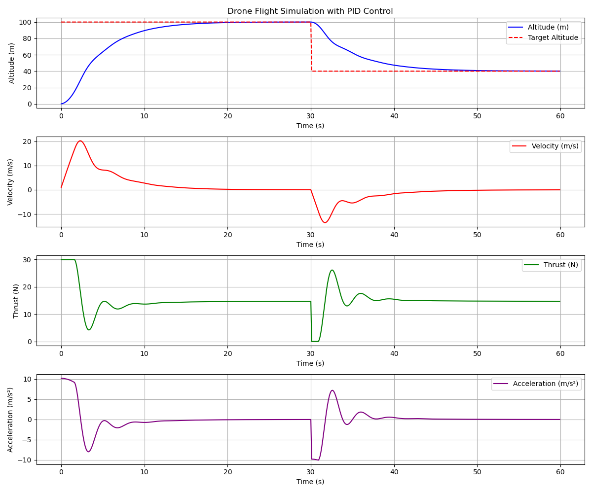

# dronesim

> a 1-D drone simulation



## build with cmake

```
dronesim % mkdir -p build && cd build
build % cmake ..
build % cmake --build .
```

## simple build and run

```
dronesim %cd src/dronesim
dronesim %g++ -std=c++23 -O2 main.cpp dronesim.cpp -o bin/dronesim
dronesim %bin/dronesim
```

Run will print a table of results:

```
dronesim % bin/dronesim                                                                     [cpp-print-results ↑1|●3✚1]
Time    Altitude    Velocity    Thrust  Acceleration    Target Alt
0   0.1019      1.019       30  10.19       100
0.1 0.305658        2.03758     30  10.1858     100
0.2 0.611146        3.05488     30  10.173      100
...
```

# MSPlot : a math simple plot

> A tiny subset of mathplotlib features
# simple-svg

Easy to use SVG library for C++ (fork)

## add Makefile, add tests and touch up the code, by @rudifa

> `make run` will compile (if needed) and run the the application simple_svg
> `make test` will compile (if needed) and run the tests
> `make clean` will clean up the files

## comments from <https://github.com/adishavit/simple-svg>

This library is a single file header-only C++ library for creating SVG files.

Simple-SVG was written to provide an easy API to allow beginners to become more accustomed to C++ by easily creating graphics.

This project creates files that can then be viewed by a sister project [File Monitor](http://code.google.com/p/file-monitor). As you make changes to your SVG document, you will automatically see an updated image in File Monitor.

This is a fork/clone of the original code [here](https://code.google.com/p/simple-svg/).
