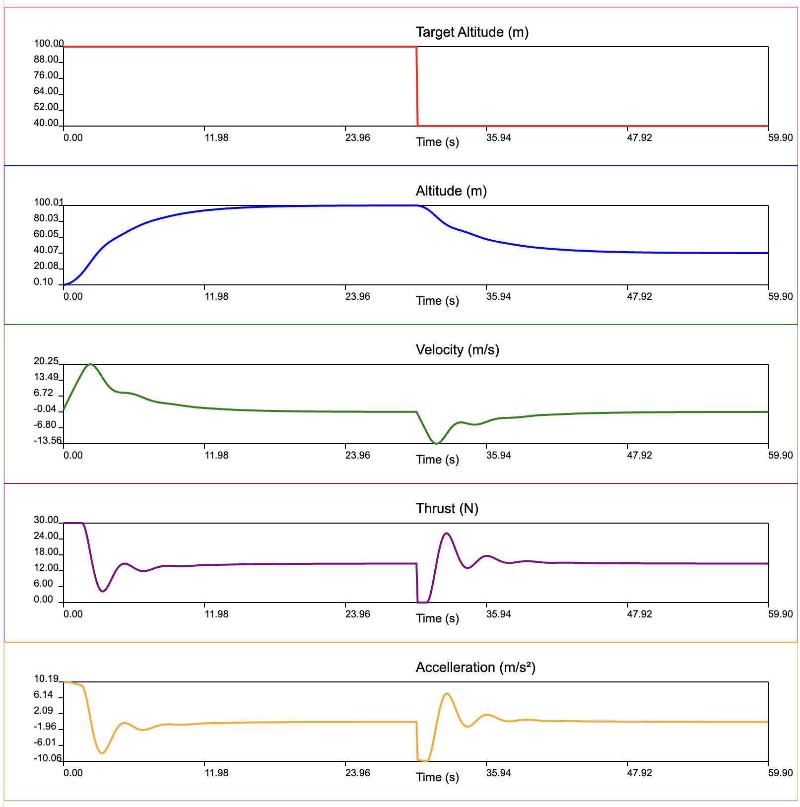

# dronesim

## 1-D simulation in python

> a 1-D drone simulation with `python/dronesim.py`


## 1-D simulation in C++

> a 1-D drone simulation with `bin/dronesim`



### build cmake files

```
dronesim % mkdir -p build && cd build
build % cmake ..
```

### build the `dronesim` application with cmake

```
build % make
build % cmake --build . # same as make
```

### run the `dronesim` application

```
dronesim % bin/dronesim
```

### build and run tests

build % make tests # build tests of simple_svg

build % make check # run tests of simple_svg

### simple build and run, without cmake

```
dronesim %cd src/dronesim
dronesim %g++ -std=c++23 -O2 main.cpp dronesim.cpp -o bin/dronesim
dronesim %bin/dronesim
```

### output file

Running `dronesim` produces the `dronesim.svg` file, which can be viewed in a browser.

## `msplot`

> `msplot` implements a tiny subset of mathplotlib features in C++.

## `simple_svg`

> `simple_svg` is a simple SVG writer in C++.
